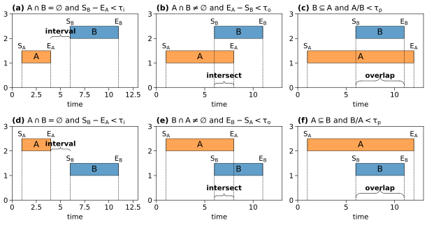

# PCEA
[](https://github.com/Koni2020/pyCEA/blob/master/README.md)


## Catalog
- [Introduction of PECA](#what-is-the-pycea)
- [Installation](#installation)
- [Dependencies](#dependencies)
- [Usage](#usage)
- [Documentation](readme/DOCUMENTATION_CN.md)
- [README_ZN [Chinese]](readme/README_CN.md)
## What is the PCEA?

PCEA is the abbreviation for Python Compound Event Analysis. 
Compound events are defined as the superposition of events within a specific time window, exhibiting six types of relationships as illustrated in the figure.
pyCEA is based on event analysis. It can identify events within signals based on specific thresholds and calculate the occurrence time, intensity, peak, and duration of those events. 
It can also detect event chains (compound events) and calculate their probabilities. An event chain refers to two events that occur synchronously in time. 
Examples include: El Niño—drought—wildfire chain events; heatwave—drought compound events; drought—flood compound events.
## Dependencies
For the installation of pyECA, the following packages are required:
* [numpy](https://numpy.org/)
* [pandas]()
* [numba]()

## Installation
pyCEA can be installed using pip\
```pip install PCEA```
## Usage
Two quick examples of pyCEA usage is as following. 
1. The data from data/demo.csv is read in, 
where the columns represent different variables and the rows represent sampling times.

```python
import numpy as np
from PCEA import CEA
import pandas as pd

# Read the data in data/demo.csv, where the columns represent different 
# variables and the rows represent sampling times.
ts = pd.read_csv("./data/demo.csv", index_col=0, header=0)
ts = ts.iloc[:, [0, 1]]
cea = CEA(ts, delta=6, threshold=[-np.inf, -0.5])
cea.run_cea(save_path='./data/resuls.xlsx')  # run compound event analysis
```
2. Input a boolean matrix of size m x n.

```python
from PCEA import CEA
import numpy as np

ts = np.random.choice([True, False], [720, 3]) # Generate a boolean matrix, 
# where True represents the occurrence of an event.

cea = CEA(ts, delta=3, is_binary_array=True) # If the input is already a boolean matrix,
cea.run_cea(save_path='./data/resuls.xlsx') # run compound event analysis
# then you need to set "is_binary" to TRUE, 
# and the threshold parameter "threshold" is not required.
```
More examples can be seen in [`Jin et al (2025)`](tutorial/compound_event_analysis.ipynb)

## References:
* [Donges J F, Schleussner C F, Siegmund J F, et al. Event coincidence analysis for quantifying statistical interrelationships between event time series: On the role of flood events as triggers of epidemic outbreaks[J]. The European Physical Journal Special Topics, 2016, 225: 471-487.](https://link.springer.com/article/10.1140/epjst/e2015-50233-y)